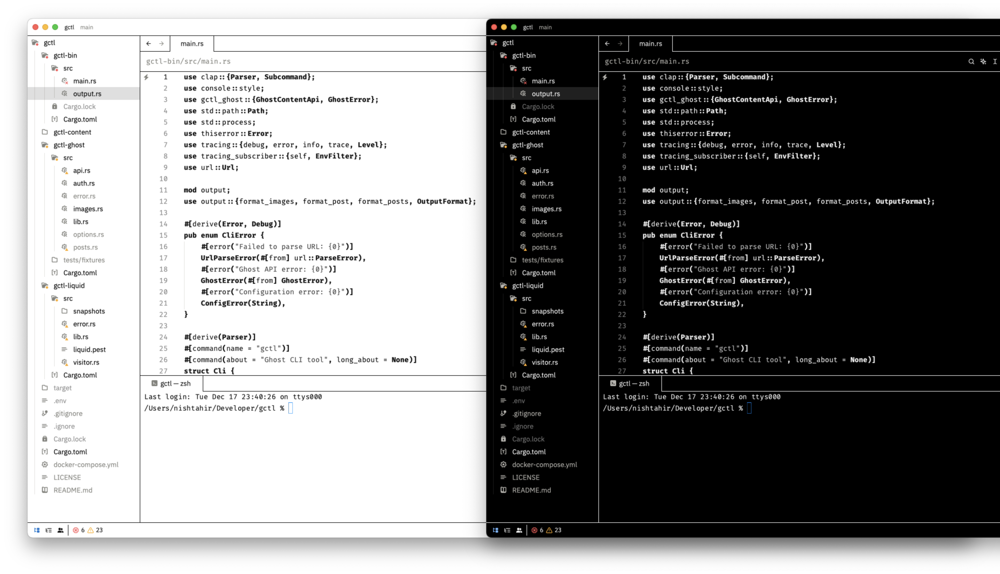

# E-ink Theme for Zed

A minimalist theme for [Zed](https://zed.dev) inspired by e-ink displays.

## Features

- Grayscale color palette mimicking e-ink displays
- High contrast ratios meeting WCAG accessibility guidelines
- Light and dark variants
- Minimal visual noise and distractions

## Installation

1. Open Zed
2. Press `Cmd/Ctrl + Shift + P` to open the command palette
3. Type "Theme" and select "Themes: Open Theme Picker"
4. Select "E-Ink Light" or "E-Ink Dark"

Alternatively, manually copy `e-ink.json` to:
- macOS: `~/.config/zed/themes/`
- Linux: `~/.config/zed/themes/`

## Screenshots

## Contributing

Feedback and contributions are welcome! Please feel free to:
- Open an issue for any bugs or suggestions
- Submit a PR with improvements
- Share your experience using the theme

## Development

To make changes to the theme, edit `style.json` and run `npm run build` to generate the theme file.
`style.json` is the light variant. The dark variant is generated by inverting the colors with a few exceptions.

`npm run install-theme` copies the file to the Zed themes directory. `npm run watch` will watch for changes and automatically
run the install command.

## License

MIT License - feel free to modify and share.

## Health and Safety
**Disclaimer:** The light theme was developed while wearing welding goggles. It it recommended that users use similar eye protection while
interacting with the theme. Users are responsible for the health and safety of their eyes, corneas and vision while using this theme.

## Credits

Inspired by [vs-code e-ink theme](https://gitlab.com/eddjrn/vs-code-e-ink-theme) by [eddjrn](https://gitlab.com/eddjrn) ISC License.
